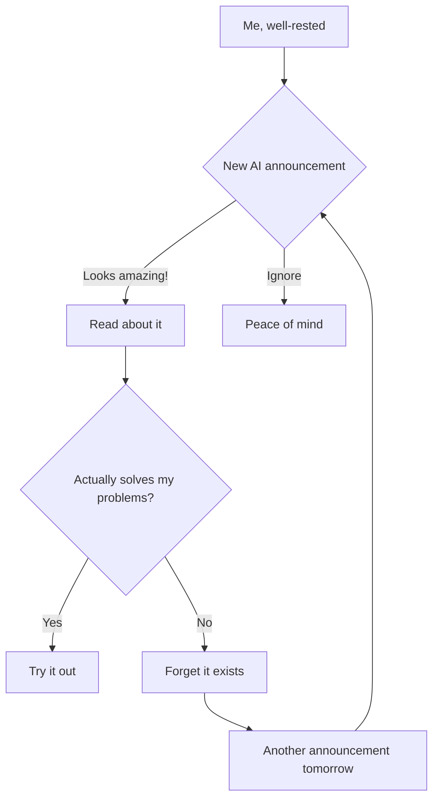

# Navigating Noise in the Age of AI Hype

Aren't we all confused by the progress made in AI every day? There's a new announcement each hour, a brand new feature that will "change the world," CEOs claiming how excited they are about their next launch, and influencers shouting how this release is a "game changer." Literally a million posts every week!

**Me, trying to keep up with AI announcements:**

## The Reality of the AI Hype Cycle

We've all been there. You open Twitter (sorry, X) and see someone raving about a new model that's "10x better than everything else." Or LinkedIn, where suddenly everyone's an expert on the latest API release they've had access to for approximately 37 minutes.

What starts as genuine curiosity quickly morphs into FOMO (Fear Of Missing Out), then anxiety, and finally the overwhelming feeling that you're somehow falling behind in your career because you haven't integrated the latest model release into your workflow... you know, the one that was announced *checks watch* 4 hours ago.

## My Sanity-Saving Filter System

After months of anxiety and countless hours spent chasing every new shiny AI toy, I've developed a system that helps me extract signal from noise. The output is always to decide how much time I spend on a new announcement:

1. **None** (or just a few seconds) 
2. **Bookmark** for later deep dive or when I have a related problem
3. **Spend real time** and try it out (actual code)

Here's my recipe for maintaining sanity in the AI hype tsunami:

### 1. The Two-Week Rule

Never pay attention to something the first time you hear it. Give it at least 2 weeks until the dust settles. If you're still hearing about it, then make time to learn about it.

Think about it - remember when [insert last month's "revolutionary" AI tool] was going to change everything? Yeah, neither does anyone else.

### 2. Curate Your Information Diet

Be selective about who you follow on social media. Follow people who are genuinely excited about technology and are not trying to sell you anything.

**Who to follow:**
- Researchers actually building these systems (Andrej Karpathy, Jeremy Howard)
- Practitioners sharing real-world experiences
- People who admit when things don't work

**Maybe avoid:**
- CEOs with a product to sell
- People who never post code, only screenshots
- Anyone whose profile says "AI Visionary"

### 3. Batch Process Your Information

Subscribe to daily newsletters but only read them at the end of the week. It's much easier to actually spend some time all at once than spending a couple of minutes each day without focus.

Recommended newsletters:
- TLDR-AI
- ImportAI
- The Batch

**Pro-tip:** Create a dedicated "AI News" time in your calendar - maybe Friday afternoon when your brain is fried anyway. Then ignore all AI news until then.

### 4. The Problem-Solution Alignment Test

Keep a log of problems you have (in my experience, I've had the same set of problems for the last year: LLMs still hallucinate, we don't know how to evaluate them properly, etc.)

For each new announcement, ask: "Does this actually solve one of my problems?" 

99% of times it won't. So you're good to move on.

### 5. Benchmark Skepticism

Don't rely too much on benchmarks. Most popular benchmarks set thresholds on how well a model performs, but most often these benchmarks don't translate well to our real-world problems.

I've seen models ace benchmarks and then completely fail at simple tasks my users need. What matters is performance on YOUR tasks, not some academic leaderboard.

### 6. Build, Don't Chase

Stay calm and focus your attention on building. You're probably not missing out that much. Look up for solutions that solve your problems instead of trying out every solution thinking it's going to solve your problem.

Remember: The people actually building useful AI products aren't spending their days doom-scrolling AI news.

### 7. Follow the Money

Question yourself about the author. Is the author trying to sell something? Is the author a builder or just an influencer influencing for the sake of influencing?

When someone is extremely enthusiastic about a new model or tool, always ask:
- Are they invested in it?
- Are they employed by the company?
- Are they trying to sell consulting services?

### 8. Make Time for Original Thought

Most importantly, wander in your own thoughts. Spend time thinking about problems and ways to solve them. If you come up with a solution, an implementation probably already exists, but then it will be an easy choice to make.

This wandering and spending time in deep thought is the key to unlocking innovation and definitely not consuming clickbait posts on social media.

## The Liberation of Not Knowing Everything

There's something incredibly freeing about accepting you can't keep up with everything. The AI field is now too vast for any single person to follow completely. Even the experts are only experts in their narrow domains.

When I finally accepted this reality, my productivity soared, and my anxiety plummeted. I started finishing projects instead of constantly pivoting to the latest technique.

## A Simple Weekly Process

Here's the process I now follow each week:

1. **Monday-Thursday**: Ignore AI news completely. Focus on building.
2. **Friday afternoon**: Spend 30 minutes reviewing the week's most significant developments.
3. **Weekend**: If something truly interesting emerged, do a deeper dive or experiment.

## The Ultimate Test: Will It Matter in a Year?

For any new AI development, ask yourself: "Will this still matter in a year?" Most won't. The ones that will are usually obvious - they represent fundamental breakthroughs, not incremental improvements or repackaging of existing techniques.

Focusing on these fundamental shifts, rather than every new release, will give you a much clearer view of where the field is actually heading.

## Conclusion

The next time you feel that pang of anxiety because everyone's talking about some new AI thing you haven't had time to investigate, remember: the truly important developments will find you. Everything else is just noise.

And in the immortal words of a wise internet meme:

*How do you manage information overload in the AI space? Share your strategies in the comments!*

