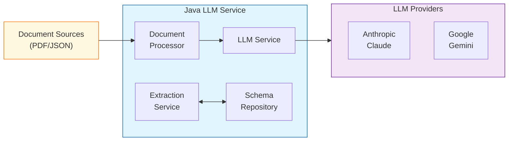

# Building a Robust PDF Data Extraction Service with Java and LLMs

## Introduction

Integrating Large Language Models (LLMs) into existing enterprise infrastructure presents significant challenges, particularly when dealing with Python runtimes. While Python is the go-to language for AI development, it often creates friction when integrating with established Java or .NET environments that many enterprises rely on.

In this article, I'll walk through how to build a Java-based service that extracts structured data from PDFs using LLMs. This approach allows for seamless integration with existing Java ecosystems while leveraging the power of modern AI models.

## The Challenge with Python Runtimes

Many organizations face these challenges when trying to integrate Python-based LLM solutions:

1. **Deployment complexity**: Managing Python dependencies in production environments
2. **Performance overhead**: Python's runtime performance compared to compiled languages
3. **Integration barriers**: Connecting Python services with Java/JVM-based systems
4. **Security considerations**: Adding new runtime environments increases attack surface
5. **Maintenance burden**: Supporting multiple language ecosystems

## Our Solution: A Java-Based LLM Service

By building our solution in Java, we create a service that:

- Integrates natively with existing Java infrastructure
- Provides stronger type safety
- Scales efficiently within existing deployment pipelines
- Reduces operational complexity

Let's dive into how we built this system.

## Architecture Overview

Our service extracts structured data from PDFs (and potentially other document types) using LLMs. Here's the high-level architecture:



## Implementation Details

### Core Components

Our service consists of these main components:

1. **Document Processing Service**: Handles document uploads and preprocessing
2. **LLM Service**: Manages interactions with different LLM providers
3. **Schema Repository**: Defines the structure for extracted data
4. **Storage Service**: Manages saving and retrieving extracted information

### Technology Stack

- **Java 11+**: Core language
- **Spring Boot**: Web framework and dependency injection
- **LangChain4J**: Java library for LLM interactions
- **Jackson**: JSON parsing and processing
- **JUnit**: Testing framework

## The LLM Service Implementation

The LLM service is the heart of our application. It abstracts away the details of different LLM providers, presenting a unified interface for document processing.

```java
public class LLMService {
    private final ChatLanguageModel chatModel;
    private final ObjectMapper objectMapper;
    private static final String OUTPUT_DIR = "outputs";
    private static final String SUMMARY_PROMPT = "Analyze this PDF document and extract all relevant information...";

    public enum InputType {
        PDF, JSON, TEXT, IMAGE
    }

    public LLMService(String apiKey, String modelType) {
        this.objectMapper = new ObjectMapper();
        this.chatModel = createChatModel(apiKey, modelType);
        createOutputDirectory();
    }

    private ChatLanguageModel createChatModel(String apiKey, String modelType) {
        switch (modelType.toLowerCase()) {
            case "gemini":
                return GoogleAiGeminiChatModel.builder()
                        .apiKey(apiKey)
                        .modelName("gemini-2.0-flash")
                        .temperature(0.0)
                        .build();
            case "anthropic":
                return AnthropicChatModel.builder()
                        .apiKey(apiKey)
                        .modelName("claude-3-7-sonnet-20250224")
                        .temperature(0.0)
                        .build();
            case "openai":
                return OpenAiChatModel.builder()
                        .apiKey(apiKey)
                        .modelName("gpt-4o")
                        .temperature(0.0)
                        .build();
            default:
                throw new IllegalArgumentException("Unsupported model type: " + modelType);
        }
    }

    public String processDocument(Path inputPath, InputType inputType, String schemaType) {
        try {
            if (inputType != InputType.PDF) {
                throw new IllegalArgumentException("Only PDF files are supported in this version");
            }

            UserMessage userMessage = createPdfMessage(inputPath);

            // Create chat request with JSON response format and schema
            JsonSchema schema;
            if (schemaType.equals("inspection")) {
                schema = JsonSchemas.jsonSchemaFrom(InspectionReport.class).get();
            } else if (schemaType.equals("new")) {
                schema = JsonSchemas.jsonSchemaFrom(NewReport.class).get();
            } else {
                throw new IllegalArgumentException("Unsupported schema type: " + schemaType);
            }

            ResponseFormat responseFormat = ResponseFormat.builder()
                    .type(ResponseFormatType.JSON)
                    .jsonSchema(schema)
                    .build();

            ChatRequest chatRequest = ChatRequest.builder()
                    .messages(userMessage)
                    .responseFormat(responseFormat)
                    .build();

            // Get response from model
            ChatResponse response = chatModel.chat(chatRequest);
            String jsonResponse = response.aiMessage().text();

            // Save the JSON response to a file
            saveJsonResponse(jsonResponse, inputPath);

            return jsonResponse;

        } catch (Exception e) {
            throw new RuntimeException("Error processing document: " + e.getMessage(), e);
        }
    }
}
```

## The Challenge with Anthropic Models

One interesting challenge we encountered was that Anthropic Claude models don't support the standard JSON response format in LangChain4J. While Google's Gemini and OpenAI's GPT models work fine with the approach above, Anthropic models require a different approach.

To work around this limitation, we created a specialized implementation for Anthropic models using the AI Service pattern with tools, which allows for more structured extraction:

```java
public class AnthropicService {
    private final AnthropicChatModel chatModel;
    private final ObjectMapper objectMapper;
    private static final Logger logger = LoggerFactory.getLogger(AnthropicService.class);

    // Service interface with tools extraction
    @AIService
    interface InspectionExtractorService {
        @Tool("extractReportId")
        String extractReportId(String text);
        
        @Tool("extractLocationDetails")
        InspectionReport.Location extractLocationDetails(String text);
        
        @Tool("extractDeviceInfo")
        InspectionReport.Device extractDeviceInfo(String text);
        
        // Additional extraction tools...
        
        InspectionReport extractInspectionReport(
            @PdfContent Path pdfPath, 
            @SystemMessage String instructions
        );
    }
    
    private final InspectionExtractorService extractorService;
    
    public AnthropicService(String apiKey) {
        this.objectMapper = new ObjectMapper();
        this.chatModel = AnthropicChatModel.builder()
                .apiKey(apiKey)
                .modelName("claude-3-7-sonnet-20250224")
                .temperature(0.0)
                .build();
                
        // Initialize the AI service with tools
        this.extractorService = AIServiceFactory.builder()
                .chatLanguageModel(chatModel)
                .build()
                .create(InspectionExtractorService.class);
    }
    
    public InspectionReport processDocument(Path pdfPath) {
        logger.info("Processing document with Anthropic model: {}", pdfPath);
        String instructions = "Extract all relevant information from this inspection report PDF.";
        
        try {
            InspectionReport report = extractorService.extractInspectionReport(pdfPath, instructions);
            logger.info("Successfully extracted report data");
            return report;
        } catch (Exception e) {
            logger.error("Error extracting report data", e);
            throw new RuntimeException("Failed to process document with Anthropic model", e);
        }
    }
}
```

## Deployment and Integration

Our service is designed for flexible deployment options:

1. **Standalone service**: Can be deployed as a standalone Spring Boot application
2. **Embedded component**: Can be integrated directly into existing Java applications
3. **AWS Lambda**: Can be packaged for serverless deployment (covered in a future article)

## Performance and Scalability

The Java-based approach offers several advantages:

1. **Efficient resource usage**: Java's mature JIT compiler and memory management
2. **Horizontal scaling**: Easily deployed across multiple instances
3. **Load balancing**: Works with standard load balancing solutions

## Future Improvements

In our next article, we'll explore:

1. **Spring AI integration**: Using Spring's official AI abstraction layer for even cleaner integration
2. **AWS Lambda deployment**: Packaging the service for serverless deployment
3. **Advanced document processing**: Handling more complex document types
4. **Caching and performance optimizations**: Reducing API costs and improving throughput

## Conclusion

Building an LLM-powered document processing service in Java offers a powerful solution for enterprises looking to leverage AI capabilities without disrupting their existing infrastructure. By using Java libraries like LangChain4J, we can create robust, scalable services that integrate seamlessly with enterprise systems.

While we encountered challenges like the lack of structured output support with Anthropic models in LangChain4J, we were able to develop effective workarounds. In our next article, we'll explore how Spring AI can provide an even more elegant solution for working with various LLM providers.

The code for this project is available on GitHub, so you can adapt it to your own document processing needs. 